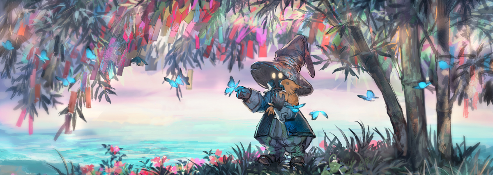
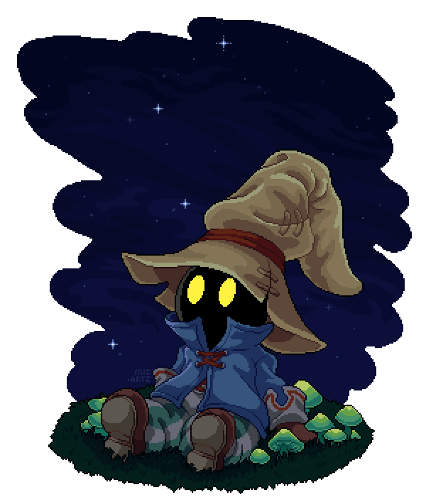

# :fallen_leaf: Welcome! Take a seat and Enjoy your Stay! :fallen_leaf:

### I'm passionate about technology and games, always looking for innovative ways to turn ideas into reality. I have experience in full-stack development and game creation, and I believe in the power of programming and artistic creativity to create unique and immersive experiences.

> _**"Life doesn't last forever. That's why we have to help each other and live life to the fullest. Even if you say goodbye,, you'll always be in our hearts."** - Vivi Ornitier_.

 

# :maple_leaf: Dream :maple_leaf:

My dream is to work with software and game development, focusing on creating innovative solutions that combine technology, art and storytelling. In the future, I plan to open my own company, where I will have enough freedom and support to turn my ideas into reality, especially about games, but also in other creative areas.

 

# :seedling: Experiences :seedling:

Although I have not yet worked formally with it, I am constantly improving my skills through personal projects, studies and practical challenges, focusing on game development and software solutions.

 

# :sparkling_heart: Passion :sparkling_heart:

My passion lies in creating immersive experiences through games, apps, art and music. I seek to explore new ways of telling stories that not only move, but also connect with the audience in a unique way.

 

# :fountain_pen: Work Philosophy :fountain_pen:

I believe that a good software developer needs to balance creativity and functionality. For me, it is essential that the final product is not only technically sound, but also engaging, accessible and meaningful to the user, something that inspires both my influences and my personal projects.

 

# :books: Inspirations :books:

### :game_die: **SQUARE ENIX** :game_die:

For the ability to create deep and innovative stories, which motivate me to create immersive narratives.

### :musical_score: **SUPERGIANT GAMES** :musical_score:

For my passion for well-developed characters and memorable soundtracks, which teach me the importance of emotion in game design.

### :art: **MIHOYO** :art:

For the affection for the aesthetics and animation of the characters and scenarios, which inspires me to always seek a balance between art and functionality.

 

# :notebook: The Journey So Far :notebook:

 

# :green_book: Hard Skills :green_book:

 

# :blue_book: Soft Skills :blue_book:

### :handshake: Teamwork :handshake:

I collaborate effectively with multidisciplinary teams to achieve common goals and generate creative solutions.

### :mega: Effective Communication :mega:

I communicate complex ideas clearly, both verbally and in writing, facilitating collaboration and understanding.

### :mag_right: Problem Solving :mag_right:

I take an analytical approach to identifying and solving challenges, always seeking creative and practical solutions.

### :gear: Adaptability :gear:

I am flexible and adapt quickly to new technologies and trends, applying them in innovative ways to projects.

### :alarm_clock: Time Management :alarm_clock:

I organize my tasks efficiently, prioritizing and meeting deadlines without compromising quality.

### :milky_way: Creativity :milky_way:

I constantly seek new ways to apply creativity, whether in technical solutions, design or user experience.

### :speech_balloon: Ability to Receive and Apply Feedback :speech_balloon:

I see feedback as an opportunity to improve my work and continually improve myself.

### :revolving_hearts: Empathy :revolving_hearts:

I put myself in the user's shoes to create more inclusive and accessible experiences, meeting their needs.

### :microscope: Critical Thinking :microscope:

I use critical thinking to analyze problems and optimize solutions, ensuring efficiency and quality.

 

# :coffee: Social Medias :coffee:

_Come talk to me sometime! Let's dream together and make them come true!_

### :star2: Thank you for your Time! See you later! :star2:

:wave: _**Profile By: Kaynerth**_ :wave:

